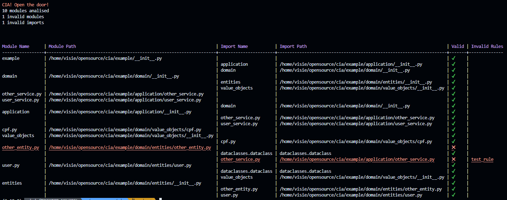

# Code Import Analysis - CIA



### Introduction
Let the CIA help you track down intruders in the wrong files!

- 100% native Python;
- Define import rules based on your project's architecture — or use the predefined ones;
- Scan your entire codebase to ensure all imports follow the rules;
- Easily integrate it into your CI/CD pipeline;
- Generate beautiful Mermaid diagrams that highlight invalid imports in red.

### How to run
```
python3.12 -m src.cia
```

##### Example
```
python3.12 -m src.cia example -r ./example/cia_rules.yml
```

_Made by devs for devs_
